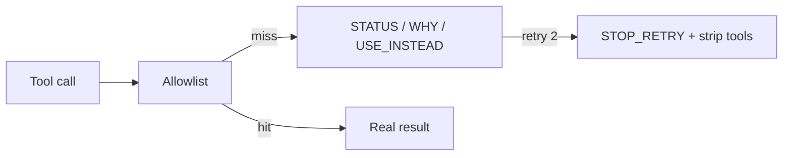

# Epistemic Deny

**If you only open one file, open [`START_HERE.md`](START_HERE.md).**


**One sentence:** Epistemic Deny formats every hard tool block as a
**packet** (`STATUS`, `WHY`, `USE_INSTEAD`, `STOP_RETRY`) so a language
model cannot narrate “permission denied” as “I confirmed the flag is unset.”

**Value proposition:** Allowlists without a compiler-error-shaped result
train the model to **invent configuration**. Two identical hard blocks
force text-only recovery. That is the whole product.

Suggested GitHub / PyPI name: **`epistemic-deny`**

## Who it helps

| Who | What they get |
| --- | --- |
| **You** | A function you return *as the tool result*, not a log line. |
| **AI agents** | A next legal move instead of another `python -c` variant. |
| **Operators** | Fewer confident lies after a deny. |

## 10-minute first success

```bash
cd epistemic-packets
python3 -m pip install -e .
python3 examples/quickstart.py
python3 -m unittest discover -s tests -q
```

Look for `STOP_RETRY` on the second identical hard block.

## How it connects to AI agents



| Style | When |
| ----- | ---- |
| **In-process** | Return `finalize_hard_allowlist_block` from your tool dispatcher. |
| **Harness** | Map host errors to this packet *before* the next model step. |

Pair with `edge-capacity-gate` (`STATUS: CAPACITY_PRESSURE` is the same family).

## Hardware / software

Python 3.10+, no GPU, no network. Stdlib only.

## Layout

| File | Role |
| ---- | ---- |
| `START_HERE.md` | 10-minute path |
| `docs/ADVANCED.md` | Why models invent state after deny |
| `docs/INTEGRATION.md` | Dispatcher + harness mapping |
| `epistemic.py` | Formatter + identical-retry counter |
| `examples/quickstart.py` | First packet |
| `tests/` | STOP_RETRY contract |

## Related

`agent-review-envelope`, `edge-capacity-gate`, `agent-loop-guardrails`.

## What others will discover (that demos hide)

These dynamics show up **after** someone else runs this in a real loop.
Ordinary READMEs skip them; they are why the kernel exists.

| Lens | In this kernel |
| ---- | -------------- |
| **Recurring pattern** | Denies are data. A blocked tool must return STATUS/WHY/USE_INSTEAD, not “permission denied.” |
| **Feedback loop** | Deny without USE_INSTEAD → python -c → /usr/bin/python3 -c. identical_retry ≥ 2 → STOP_RETRY is the breaker. |
| **Hidden incentive** | Models are rewarded for answering. After a deny they invent negative evidence (“flag unset”). |
| **Leverage point** | Put the packet in the *tool result*, not syslog. If the model never sees it, it will lie. |
| **Asymmetry** | Restricted vs blocked vs unknown need different RETRY_RULE lines. One word “blocked” is too small. |
| **Cause → effect** | Allowlist miss + prose error → hallucinated .env. Packet + force_text → model quotes STATUS. |
| **Opportunity** | Every allowlisted agent on the internet hits this bug. Search: LLM hallucinates after permission denied. |
| **Risk if copied blindly** | Hosts that stringify exceptions into friendly English undo the packet. |

Deeper case studies: [`docs/ADVANCED.md`](docs/ADVANCED.md). Wiring: [`docs/INTEGRATION.md`](docs/INTEGRATION.md).


## License

MIT.
