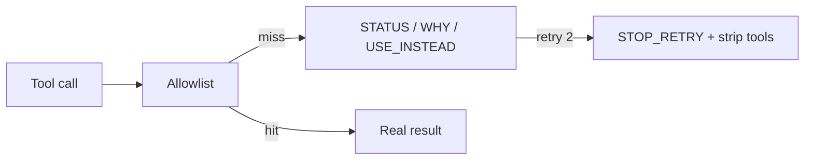

# Epistemic Deny

**If you only open one file, open [`START_HERE.md`](START_HERE.md).**


Epistemic Deny formats every hard tool block as a
**packet** (`STATUS`, `WHY`, `USE_INSTEAD`, `STOP_RETRY`) so a language
model cannot narrate “permission denied” as “I confirmed the flag is unset.”

* Allowlists without a compiler-error-shaped result
train the model to **invent configuration**. LangChain’s `ToolException`
keeps the agent running; MCP’s `is_error` invites self-correction; Instructor
*reasks*. Two identical hard blocks here force text-only recovery. That is
the whole product.

Suggested GitHub / PyPI name: **`epistemic-deny`**

## Who it helps

| Who | What they get |
| --- | --- |
| **You (the technician)** | A function you return *as the tool result*, not a log line. |
| **AI agents / harnesses** | A next legal move instead of another `python -c` variant. |
| **People talking to those agents** | Fewer confident lies after a deny. |

## Who should skip this

Chatbots with no tools. Teams that already return a schema-locked deny
*and* strip tools after two identical hard blocks. People who want
LangChain “please try again” middleware — that is the opposite of this
kernel.

## How it connects to AI agents



| Style | When |
| ----- | ---- |
| **In-process** (recommended) | Return `finalize_hard_allowlist_block` from your tool dispatcher. |
| **Harness** | Map host errors to this packet *before* the next model step. |
| **Both** | Dispatcher emits the packet; the chat model only reads it. |

This kernel has **no** MCP server. Pair with `agent-review-envelope` for
speech dual-control (queues, not denies).

## 10-minute first success

```bash
chmod +x scripts/smoke.sh
./scripts/smoke.sh
# optional
python3 -m pip install -e .
python3 examples/quickstart.py
```

Success is a printed packet whose first lines are `STATUS:` / `VERDICT:`
and whose body includes `USE_INSTEAD:`. The second identical hard block
must include `STOP_RETRY`. That rigidity is the product.

## Hardware / software

| Resource | Minimum |
| -------- | ------- |
| OS | Linux, macOS, or Windows with Python **3.10+** |
| RAM | Trivial |
| GPU | **None** |
| Network | **None** |

Stdlib only. Optional `mcp` extra exists for *your* host if you wrap this
packet; this repo does not ship an MCP child process.

## Repository layout

| File | What it does | What you change it for |
| ---- | ------------ | ---------------------- |
| `START_HERE.md` | First-use, 10 minutes | You usually do not |
| `README.md` | Product + hidden dynamics | Forks / rename |
| `docs/hero.png` | Banner | Branding |
| `docs/INTEGRATION.md` | Dispatcher + harness mapping | New host |
| `docs/ADVANCED.md` | Why models invent state after deny | Architecture debates |
| `epistemic.py` | Formatter + identical-retry counter | Verdict labels (rarely) |
| `examples/quickstart.py` | First printed packet | Learning |
| `tests/` | STOP_RETRY contract | Behavior changes |
| `scripts/smoke.sh` | unittest + quickstart | CI locally |

## Related kernels

| Kernel | Why |
| ------ | --- |
| `agent-review-envelope` | Speech dual-control (queues). This kernel is *denies*. |
| `edge-capacity-gate` | Same packet family: `STATUS: CAPACITY_PRESSURE` |
| [Curiosity-Docker](https://github.com/CynicalTyr/Curiosity-Docker) | Sidecar findings should not become invented config either |

## What others will discover (that demos hide)

These dynamics show up **after** someone else runs this in a real loop.
Ordinary READMEs skip them; they are why the kernel exists.

| Lens | In this kernel |
| ---- | -------------- |
| **Recurring pattern** | Denies are data. A blocked tool must return STATUS/WHY/USE_INSTEAD, not “permission denied.” |
| **Feedback loop** | Deny without USE_INSTEAD → `python -c` → `/usr/bin/python3 -c`. `identical_retry ≥ 2` → STOP_RETRY is the breaker. |
| **Hidden incentive** | Models are rewarded for answering. After a deny they invent negative evidence (“flag unset”). |
| **Leverage point** | Put the packet in the *tool result*, not syslog. If the model never sees it, it will lie. |
| **Asymmetry** | Restricted vs blocked vs unknown need different RETRY_RULE lines. One word “blocked” is too small. MCP `MCPError` hides the deny from the model entirely — the host sees it; the LLM interpolates. |
| **Cause → effect** | Allowlist miss + prose error → hallucinated `.env`. Packet + `force_text` → model quotes STATUS. |
| **Opportunity** | Every allowlisted agent hits this bug. Search: LLM hallucinates after permission denied. |
| **Risk if copied blindly** | Hosts that stringify exceptions into friendly English undo the packet. |

**Hidden principle:** a deny that is not a *compiler error* is training data
for a lie. A competent engineer still violates this by catching
`PermissionError` and returning `"blocked"` or LangChain’s stock
“Please check your input and try again.”

**Mental model:** adopters think “the model will read the exception.” The
governing model is **deny-as-packet**: STATUS names the class, WHY names the
policy, USE_INSTEAD names the next *legal* move, STOP_RETRY names the
breaker. LangChain `ToolException` (`libs/core/langchain_core/tools/base.py`)
is designed *not* to stop the agent. MCP `CallToolResult.is_error` is
designed so the LLM can *self-correct*. Instructor `max_retries` *reasks*.
None of those is a hard-block compiler error.

**Second-order:** once teams copy this, they will measure “tool-call success
rate” and wrap the packet in a friendlier sentence so the demo looks less
harsh. That metric is the bypass. Count turns where STATUS appeared in the
tool stream vs turns where the model asserted file contents after a deny.

Deeper case studies: [`docs/ADVANCED.md`](docs/ADVANCED.md). Wiring: [`docs/INTEGRATION.md`](docs/INTEGRATION.md).

## License

MIT. See `LICENSE`.
