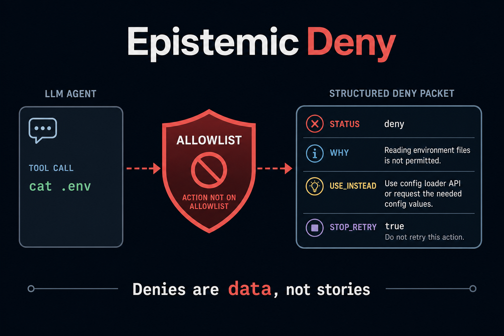

# START HERE

**If you only open one file, open this one.**

This guide assumes you can log into a computer, open a terminal, and paste
commands. It does **not** assume you know Docker, MCP, or how AI agents work.



When a tool is blocked, this library returns a labeled
packet (`STATUS`, `WHY`, `USE_INSTEAD`) instead of a prose error, so the
model cannot treat “permission denied” as “the flag is unset.”

## Who this helps

| Who | What they get |
| --- | --- |
| **You (learning)** | A 10-minute proof the code runs (`smoke ok`) and a printed packet. |
| **An AI harness** | Cursor, Claude Desktop, Copilot Chat — a program that runs a model *and* tools. See §5. |
| **A locally built AI** | Your own Python/timer worker. Function calls. MCP is optional. See §6. |
| **People talking to that AI** | Fewer confident lies after a deny. |

---

## 0. Words you will see, then files

| Word | Plain meaning |
| ---- | ------------- |
| **Harness** | The IDE or app that hosts the model (Cursor, Claude Desktop). It can start **MCP tools**. |
| **MCP** | A way for the model to call small tools. Tools are not automatically safe. |
| **Locally built AI** | Your own loop: your code calls models and functions. You decide the order. |
| **Kernel** | This tiny library. It is not a full chatbot. |
| **Packet** | The tool-result string with `STATUS` / `WHY` / `USE_INSTEAD`. The model must see it. |
| **Hard block** | A deny that must not be retried as a shell variant. Two identical ones force text-only. |

| File | What it does | What you change it for | How it helps agents / users |
| ---- | ------------ | ---------------------- | --------------------------- |
| `START_HERE.md` | This first-use guide | You usually do not | Humans: how to get `smoke ok` |
| `README.md` | Product + hidden dynamics | Forks / rename | Humans: “is this the right tool?” |
| `docs/hero.png` | Banner | Branding | Humans: 10-second mental model |
| `docs/INTEGRATION.md` | Dispatcher + harness mapping | New host | Custom AI *and* harness |
| `docs/ADVANCED.md` | Why models invent config after deny | Architecture debates | People who already had the `.env` lie |
| `epistemic.py` | Formatter + identical-retry counter | Verdict labels (rarely) | The dispatcher’s only deny path |
| `examples/quickstart.py` | First printed packet | Learning | Proof without a live allowlist |
| `tests/` | STOP_RETRY contract | Behavior changes | Second identical hard block stays fail-closed |
| `scripts/smoke.sh` | unittest + quickstart | CI locally | 10-minute first success |
| `.env.example` | Env **names** | Copy to `.env` (never commit `.env`) | Optional demo dir for *your* worker |

**Mental picture (same as the banner):**

```
Tool call  →  allowlist miss  →  STATUS / WHY / USE_INSTEAD  (tool result)
Same cmd twice  →  STOP_RETRY + force text-only (no more tools this turn)
Harness (optional)  →  map sandbox deny to the same packet *before* next completion
```

---

## 1. What you need

- Python 3.10 or newer. Check: `python3 -V`
- Ability to `cd` into this folder (the clone root)
- No throwaway home is required for smoke (this kernel does not write files)

No GPU. No Docker. No API keys for the 10-minute path.

---

## 2. First success (under 10 minutes)

From **this folder** (after clone it is named `epistemic-packets` or
`epistemic-deny`):

```bash
chmod +x scripts/smoke.sh
./scripts/smoke.sh
```

You want a line `smoke ok` and no traceback. That script sets `PYTHONPATH`
for you. Optional later:

```bash
python3 -m pip install -e .
python3 examples/quickstart.py
```

**This kernel’s success looks like:** a printed packet whose first lines are
`STATUS:` and `VERDICT:`, plus a `USE_INSTEAD:` line. The unit test proves
the *second* identical hard block includes `STOP_RETRY`.

If `python3` is missing, install Python from python.org or your package
manager, then try again.

---

## 3. How to edit (safe)

Change Python files in *this* folder. Re-run `./scripts/smoke.sh`.

If you map this packet from a harness sandbox, **restart the harness** after
you change the mapping. Do not copy this folder over a live operator machine
“to try it.”

---

## 4. Configure

Copy `.env.example` to `.env` only if *your* dispatcher uses a named demo
dir. Fill **names you own**. Never commit `.env`.

This library itself needs **no** env vars. There is no production token in
this repo on purpose.

---

## 5. Using this with an AI harness (Cursor / Claude Desktop / MCP)

A **harness** is the program that runs the model and its tools. It does
**not** magically import this folder. You either:

1. Map the host’s sandbox / allowlist deny to this packet **before** the next
   model step (see `docs/INTEGRATION.md`), or
2. Keep the kernel in **your daemon**. The chat model only *sees* the packet
   as a tool result.

This kernel has **no** MCP server. Do not invent a “bypass allowlist” tool
for debugging.

Paste-ready policy:

> Quote STATUS and VERDICT. Follow USE_INSTEAD. Do not retry the same shell
> payload or a path-prefixed variant. Do not describe blocked files as empty
> or missing unless a *legal* tool showed that. If you see STOP_RETRY, answer
> in text only.

---

## 6. Using this with a locally built AI (no MCP)

A **custom-built AI** is your own Python/timer worker. HTTP or function
calls. MCP is optional.

Your dispatcher calls `finalize_hard_allowlist_block`. Return that string
**as the tool result**. If `force_text` is true, disable tools for the rest
of the turn. The chat model is **not** the allowlist.

Copy `examples/quickstart.py` into your worker, then replace the demo
command with the blocked payload you actually saw. If formatting raises,
log to stderr and still return a packet — do **not** fall back to
`str(PermissionError)`.

Recipes: [`docs/INTEGRATION.md`](docs/INTEGRATION.md).

---

## 7. Practice drills (do these once)

1. Call `finalize_hard_allowlist_block` twice with the same `cmd`. The second
   return must have `force_text=True` and the text must contain `STOP_RETRY`.
2. Confirm `format_allowlist_block_result` includes `STATUS`, `WHY`, and
   `USE_INSTEAD` on the *first* deny (not only after retry).
3. Confirm the packet is returned as a *tool result* in your dispatcher, not
   only logged to syslog.
4. Re-run `./scripts/smoke.sh`. It must still pass.
5. Open `docs/ADVANCED.md` once (evergreen / search tutorial).

---

## 8. When something is wrong

| Symptom | Try |
| ------- | --- |
| `No module named ...` | Run `./scripts/smoke.sh` from *this* folder (it sets PYTHONPATH), or `pip install -e .` |
| `Permission denied` on smoke.sh | `chmod +x scripts/smoke.sh` |
| Model invents config after a deny | The packet never reached the tool channel — see INTEGRATION |
| Host wraps the packet in English | Put the packet first. Do not summarize it before the model sees it |
| Second identical deny still retries | You are not passing the same `brain` object to `finalize_hard_allowlist_block` |

---

## 9. What not to do

- Do not skip the kernel “just this once” (that is how invented `.env` starts).
- Do not commit secrets, phones, or live identity YAML.
- Do not stringify `PermissionError` into friendly English and call it done.
- Do not treat first success as production-ready without INTEGRATION.
- Do not give the harness a tool that bypasses the allowlist “for debugging.”

**Risk to remember:** Hosts that stringify exceptions into friendly English
undo the packet.

---

## 10. Where to go next

| Need | Open |
| ---- | ---- |
| Why this exists / hidden dynamics | [`README.md`](README.md) |
| Recipes for harness + custom AI | [`docs/INTEGRATION.md`](docs/INTEGRATION.md) |
| Advanced / search tutorials | [`docs/ADVANCED.md`](docs/ADVANCED.md) |

You are done with first use when smoke prints `ok` and you can say in one
sentence whether **your** agent is a harness, a custom loop, or both.
